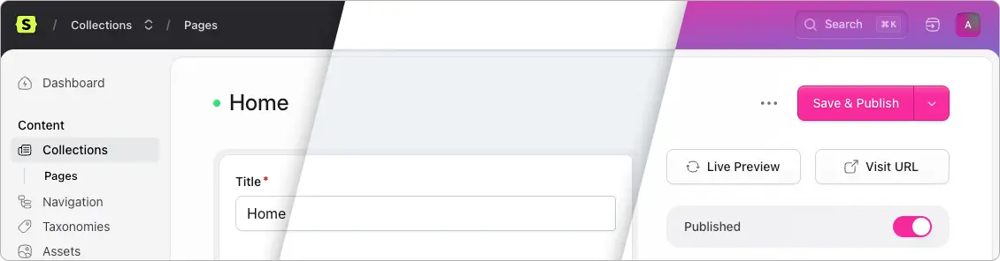

# Statamic Themes

Let users choose their perferred control Panel theme in Statamic 6



## Installation

Install the addon via composer:

```
composer require heidkaemper/statamic-themes
```

> [!WARNING]
> This a addon is still under development
